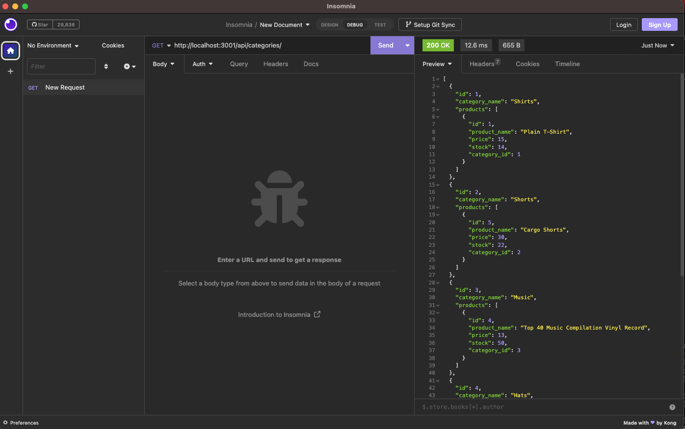

# Ecommerce Backend
This project is the backend for an ecommerce site built using an Express.js API to use Sequelize to interact with a MySQL database. 

Routes were created to enable CRUD operations to and from the db. Models were used to define data structures for different product types. Index files used to handle routing above/to individual routes. 

Needs video accompanying, need to make a youtube to host it. Link to follow. 

Proof of concept:
